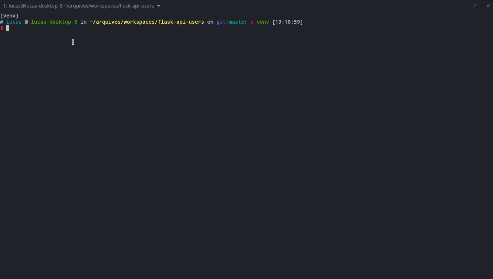
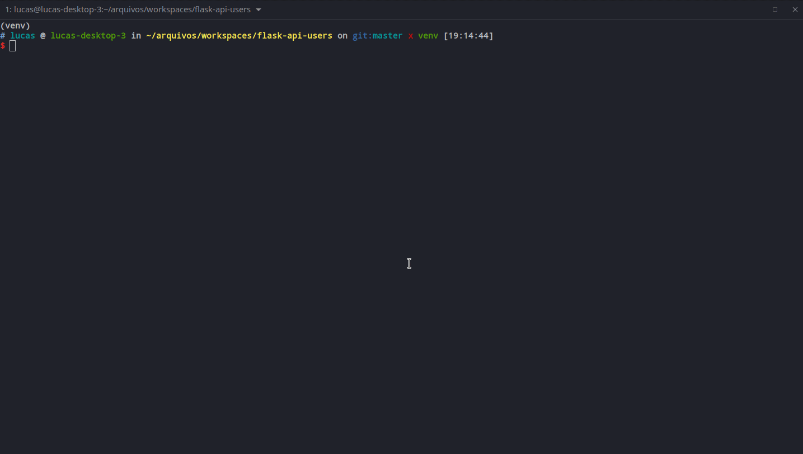
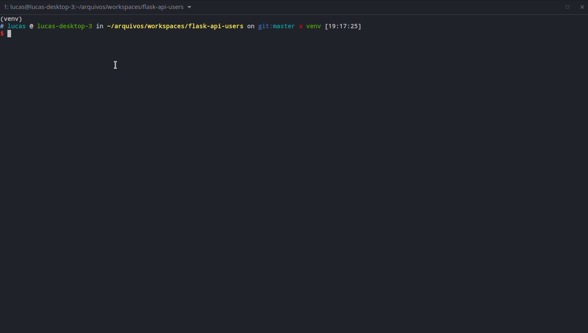
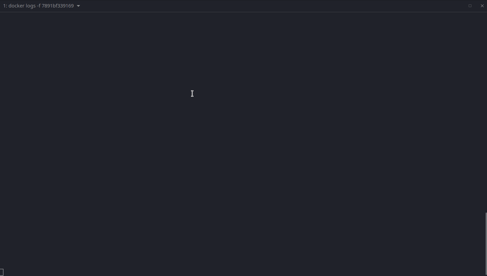
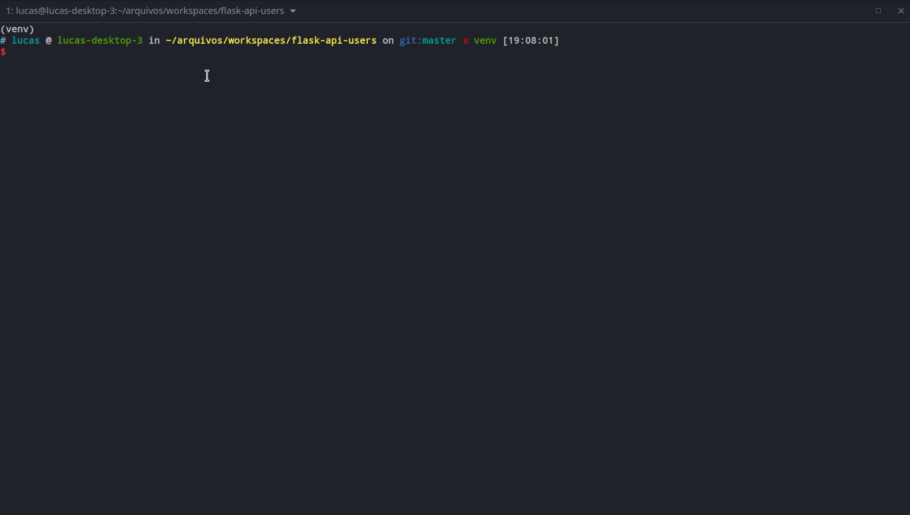

# flask-api-users

Api para gerenciamento de usuários/customers com Flask Framework, MongoDB e autenticação JWT


## Crie MongoDB

```shell
docker run -itd --name mongo-latest -p 27017:27017 --network local-containers mongo
```

## Setup com virtualenv

Inicializar o virtualenv `python3 -m venv venv` e em seguida ativar o virtualenv `source venv/bin/activate`

Se houver o `poetry` instalado pode executar `poetry install` ou instalar via pip `pip install -r requirements/base.txt`

#### Excute a aplicação de dev

Necessário que o mongodb esteja executando

```shell
$ python run.py
```

ou

```shell
$ flask run --host=0.0.0.0 --port=8080 --debugger
```




## Criar um superusuario para executar os endpoints

Via local

```shell
$ flask createsuperuser admin admin@admin.com teste123
```




## Excute a aplicação via docker

Primeiro faço um build da minha imagem

```shell
$ docker build -t api_users .
```

Em seguida executar o container a partir da imagem criada. Altere seu `.env` e descomente a linha `; MONGODB_URI=mongodb://mongo-latest:27017/api-users` colocando o hostname do mongo `mongo-latest`. Então crie o container com o comando abaixo.

```shell
$ docker run -itd --name users_local --env-file ./.env -p 8080:8080 --network local-containers  users
```

Criar superuser via docker.



Criando um usuario  ou um customers de exemplo, com validação de cpf



## Docker compose

A ser testado. Não utilize essa opção por enquanto.

## Insomnia collection

Pode baixar a coleção do insomnia na pasta static e importar no app

[](./static/Insomnia_2023-05-11.json)

## Testes

```shell
$ pytest
```

ou

```shell
$ make test
```



## Roadmap

* Capítulo 1: [Introdução, configuração e Hello World](https://www.lucassimon.com.br/2018/06/serie-api-em-flask---parte-1---introducao-configuracao-e-hello-world/)

* Capítulo 2: [Organizando as dependências e requerimentos](https://lucassimon.com.br/2018/06/serie-api-em-flask---parte-2---organizando-as-dependencias-e-requerimentos/)

* Capítulo 3: [Configurando o pytest e nosso primeiro teste](https://lucassimon.com.br/2018/06/serie-api-em-flask---parte-3---configurando-o-pytest-e-nosso-primeiro-teste/)

* Capítulo 4: [Configurando o Makefile](https://lucassimon.com.br/2018/06/serie-api-em-flask---parte-4---configurando-o-makefile/)

* Capítulo 5: [Adicionando o MongoDB a API](https://lucassimon.com.br/2018/07/serie-api-em-flask---parte-5---mongodb/)

* Capítulo 6: [Criando e testando nosso modelo de usuários](https://lucassimon.com.br/2018/10/serie-api-em-flask---parte-6---criando-e-testando-nosso-modelo-de-usuarios/)

* Capítulo 7: [Criando usuários](https://lucassimon.com.br/2018/10/serie-api-em-flask---parte-7---criando-usuarios/)

* Capítulo 8: [Listando usuários](https://lucassimon.com.br/2018/10/serie-api-em-flask---parte-8---listando-usuarios/)

* Capítulo 9: [Buscando usuários](https://lucassimon.com.br/2018/10/serie-api-em-flask---parte-9---buscando-usuarios/)

* Capítulo 10: [Editando um usuário](https://lucassimon.com.br/2018/10/serie-api-em-flask---parte-10---editando-um-usuario/)

* Capítulo 11: [Deletando um usuário](https://lucassimon.com.br/2018/10/serie-api-em-flask---parte-11---deletando-um-usuario/)

* Capítulo 12: [Autênticação por JWT](https://lucassimon.com.br/2018/10/serie-api-em-flask---parte-12---autenticacao-por-jwt/)

* Capítulo 13: [Criando um container docker](https://lucassimon.com.br/2018/10/serie-api-em-flask---parte-13---criando-um-container-docker/)

* Capítulo 14: [Deploy Flask na Digital Ocean](https://lucassimon.com.br/2018/10/serie-api-em-flask---parte-14---arquivos-de-configuracao-para-deploy-na-digital-ocean/)

* Capítulo 15: [Automatizando o processo de deploy com Fabric](https://lucassimon.com.br/2018/11/serie-api-em-flask---parte-15---automatizando-o-processo-de-deploy-com-fabric/)

* Capítulo 16: [CI e CD com Jenkins, Python, Flask e Fabric](https://lucassimon.com.br/2018/11/serie-api-em-flask---parte-16---ci-e-cd-com-jenkins-python-flask-e-fabric/)
